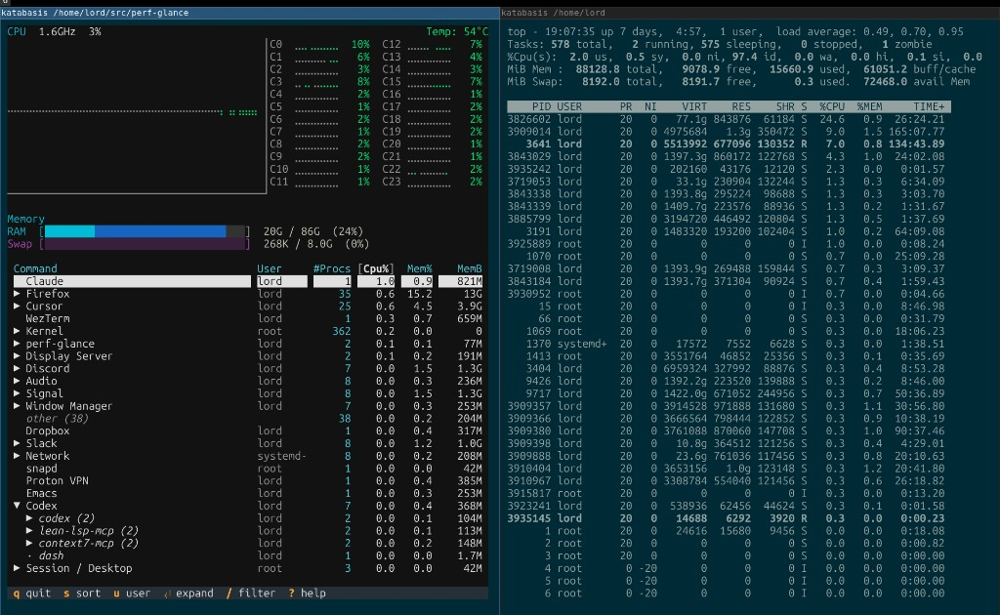

# perf-glance

A terminal-based system utilization monitor for Linux. Instead of
hundreds of raw process names, you see **Firefox** (35 procs, 13G),
**Cursor** (29 procs), **Slack**, **Discord** — apps, build tools, and
system services grouped by category in an expandable hierarchy. Expand
Firefox to see "Isolated Web Co (24)", "WebExtensions", "RDD Process";
expand Cursor for Main Process, Zygote, Utility. `.desktop` files and
known patterns recognize apps automatically; interpreters like Python
and Node are transparent — `python myscript.py` shows *myscript*, not
*python3*.

See [docs/grouping.md](docs/grouping.md) for grouping internals and
[docs/rules.md](docs/rules.md) for user-configurable grouping rules.

Screenshot: **perf-glance** (left) vs **top** (right):


## Features

- CPU utilization with per-core bars and historical graph
- CPU frequency and temperature (when available)
- Memory (RAM and swap) with used/cached distinction
- Hierarchical process grouping with expand/collapse
- Configurable grouping rules via `rules.d` 
- Process table `Cum%` column: cumulative CPU share since reset
- Configurable refresh interval, sorting, and theme


## Quick Start

**One-liner (no install):** download the wrapper script and run:

```sh
curl -O https://raw.githubusercontent.com/vzaliva/perf-glance/main/perf-glance
chmod +x perf-glance
./perf-glance
```

The script uses [uv](https://docs.astral.sh/uv/) to fetch and run perf-glance from GitHub on first use.

Or via uvx / install:

```sh
uvx perf-glance
```

```sh
uv tool install perf-glance
perf-glance
```

## Contributing

See [docs/TODO.md](docs/TODO.md) for a list of potential enhancements.
Feel free to submit a pull request implementing any of them. Also see
[docs/dev.md](docs/dev.md) for development hints.

## Configuration

Config file: `~/.config/perf-glance/config.toml` (created with defaults on first run).
Grouping rules: `~/.config/perf-glance/rules.d/*.toml` (see [docs/rules.md](docs/rules.md)).

## Disclaimers

0. Linux-only; developed on Ubuntu - some behavior may be Ubuntu-specific

1. UI was inspired by [btop](https://github.com/aristocratos/btop)

2. I vibe-coded this app with AI. I know enough Python to implement it
   myself, but my goal was not to write some beautiful code. My
   objectives were utilitarian: 1) to build a tool I wanted to have
   personally, 2) to explore an idea of user-friendly process
   classification. However, I take full responsibility for this code
   and I will maintain it, fix bugs, and welcome pull requests.
